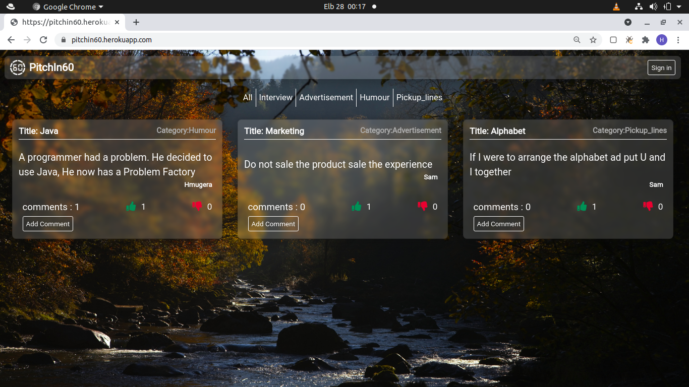

# PitchIn60

Inspired by the term "Gone in 60 seconds"

## Description

Pitchin60 is a python(flask) web application that displays user-posted 60 seconds pitches based on different categories. As a user one can sign up and login then view,comment,like,dislike or add a new pitch.
Visit site [Click here](https://pitchin60.herokuapp.com/)

## Author

[Mugera Hughes](https://github.com/mugerah/)

## Landing Page 

## User Story

1. As a user, I would like to see the pitches other people have posted.
2. As a user, I would like to vote on the pitch they liked and give it a downvote or upvote.
3. As a user, I would like to be signed in for me to leave a comment
4. As a user, I would like to receive a welcoming email once I sign up.
5. As a user, I would like to view the pitches I have created in my profile page.
6. As a user, I would like to comment on the different pitches and leave feedback.
7. As a user, I would like to submit a pitch in any category.
8. As a user, I would like to comment on the different pitches and leave feedback.
9. As a user, I would like to view the different categories.

## Behaviour Driven Development (BDD)

|Behaviour 	           |    Input 	                 |       Output          |
|----------------------------------------------|:-----------------------------------:|-----------------------------:|       
|  View pitches based on category|  Open app and select category of pitch  |  Pitch list is displayed based on selected category   |                       |
|Signing Up|If user hasn't signed up he/she clicks sign in link on navbar and clicks the sign up link at the bottom of login page where they will be redirected to sign up form that they will have to fill and submit |User is redirected to login page then t0 sign up page and is able to sign up|    |
Signing In|User clicks on sign in link on navbar and is redirected to login for where he/she enters user email and password that they registered with and clicks submit  |User is redirected to landing page and is able to add,comment,like,dislike and edit their profile |    |
Adding pitch |Once logged in a user can click add pitch link on navbar to go into the add pitch page where there is a form for a new pitch, which they fill and click submit  | User is redirected to add pitch page after filling in form and clicking submit user is redirected to home page and their add pitch is displayed |    
|View comments and commenting on a pitch|Once logged in a user can click the add comments button on a pitch to view diffrent comments and add a comment of their own by filling in the comments form and cicking submit  | User post comment is added to comments list |    |
Upvote or downvote pitch |Once logged in a user can click the thumbs up icon to upvote a pitch or click the thumbs down icon to downvote a pitch  | The pitch's upvote and downvote count displayed on pitch increments depending on icon clicked |    
|Edit profile|Once logged in a user can click the user dropdown link with their name on the navbar and select profile link  | User is redirected profile page where he/she can see their own posts and can update their personal details i.e update profile picture and bio |    

## Setup/Installation Requirements

### Getting the code

- Step 1 : Clone this repository:

  - git clone (https://github.com/MugeraH/pitchIn60.git)

- Step 2 : Navigate to directory:
  - cd pitchIn60
- Step 3 : Open the directory created with your IDE.
  - code .(for Vs Code) or atom .(for Atom)

### Running the Application

1. Pre-requisites

   - Ensure to activate virtual environment called virtual,using:

     - source virtual/bin/activate

   - Install flask and pip
   - Install flask_script
2. Inside the manage.py module change the config_name parameter from 'production' to 'development' ie app = create_app('production') should be app = create_app    ('development')
3. Add the export configurations in start.sh
   - export SECRET_KEY= "Your secret key"
   - export MAIL_USERNAME= "Your Email"
   - export MAIL_PASSORD= "Your Password"
2. Run using the executable file ,with command :
   - ./start.sh

## Technologies Used

- [Python3.8](https://www.python.org/)
- [Flask](http://flask.pocoo.org/)
- [Heroku](https://heroku.com)
- Postgres
- HTML
- CSS
- Bootstrap 4.3.1

## Contact Information

For any further inquiries or contributions or comments, reach me at [Mugera Hughes](https://github.com/MugeraH)

### License

[MIT License](https://github.com/MugeraH/pitchIn60/blob/main/license)

Copyright (c) 2021
